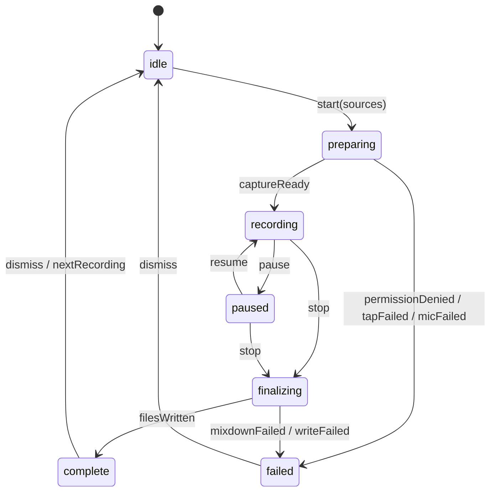
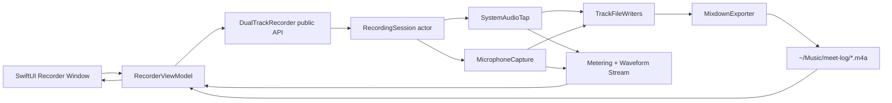

# meet-log MVP Implementation Plan

最終更新: 2026-05-18

## 目的

macOS 14.2+ 向けに、システム音声とマイクを同時録音し、停止時に 2 トラック音声とミックス済み音声を `~/Music/meet-log/` へ保存する最小構成のネイティブアプリを実装する。

MVP は録音体験に集中する。ライブラリ、タグ、共有、保存先変更、動画キャプチャ、拡張モードは後フェーズに回す。

## 設計方針

- Xcode workspace は使わず、既存の単一 `.xcodeproj` にアプリ本体と `DualTrackRecorder` framework を置く。
- `DualTrackRecorder` は SwiftUI 非依存にし、Foundation / CoreAudio / AVFoundation のみを扱う。
- UI は `DualTrackRecorder` の public API だけを呼び、Process Tap、AVAudioEngine、mixdown、ファイル保存の詳細を UI から隠す。
- 録音結果は 2 トラック並行保存を正とし、停止時に mixdown を生成する。音量差のリカバリ余地を残すため、素材トラックも保持する。
- MVP の pause / resume は実装対象に含める。ただし音声ファイルのセグメント結合コストがあるため、先に session model とテストで境界を固定する。

## システム図

### 状態マシン



### データフロー



## Public API 境界

`DualTrackRecorder` は次の 3 点を public surface とする。

```swift
public actor DualTrackRecorder {
    public init(configuration: RecorderConfiguration = .default)
    public func start(sources: RecordingSources) async throws
    public func pause() async throws
    public func resume() async throws
    public func stop() async throws -> RecordingResult
    public var events: AsyncStream<RecorderEvent> { get }
}

public enum RecorderState: Equatable {
    case idle
    case preparing
    case recording(startedAt: Date)
    case paused(elapsed: Duration)
    case finalizing
    case complete(RecordingResult)
    case failed(RecorderError)
}

public struct RecordingResult: Equatable, Sendable {
    public let duration: Duration
    public let systemAudioURL: URL?
    public let microphoneURL: URL?
    public let mixdownURL: URL
    public let displayFileName: String
}
```

UI 側では `RecorderViewModel` が `events` を購読し、状態、タイマー、レベル、波形、保存完了表示へ変換する。

## フォルダ構造

### 現在

```text
meet-log/
  meet-log.xcodeproj/
  meet-log/
    ContentView.swift
    meet_logApp.swift
  meet-logTests/
  meet-logUITests/
```

### MVP 完了時

```text
meet-log/
  meet-log.xcodeproj/
  meet-log/
    App/
      meet_logApp.swift
    Features/Recorder/
      RecorderView.swift
      RecorderViewModel.swift
      RecorderControls.swift
      RecorderLevelView.swift
      RecordingCompleteView.swift
    Support/
      AppCommands.swift
  DualTrackRecorder/
    Sources/
      DualTrackRecorder.swift
      RecorderConfiguration.swift
      RecorderState.swift
      RecorderEvent.swift
      RecorderError.swift
      RecordingSources.swift
      RecordingResult.swift
      Session/
        RecordingSession.swift
        RecordingClock.swift
      Capture/
        SystemAudioTap.swift
        MicrophoneCapture.swift
        AudioLevelMeter.swift
      FileIO/
        OutputDirectory.swift
        TrackFileWriter.swift
        MixdownExporter.swift
  DualTrackRecorderTests/
```

## 実装フェーズ

1. プロジェクト構造を整える。
   - `DualTrackRecorder` framework target を追加する。
   - アプリ本体から framework を embed する。
   - SwiftUI と core の import 境界を固定する。

2. core の public API と状態モデルを先に実装する。
   - 録音開始、pause、resume、stop、イベント stream の型を定義する。
   - 実 capture なしの fake session で状態遷移テストを通す。

3. 音声 capture の最小実装を接続する。
   - Process Tap によるシステム音声取得を `SystemAudioTap` に隔離する。
   - AVAudioEngine によるマイク取得を `MicrophoneCapture` に隔離する。
   - レベル / 波形イベントを UI 非依存の値として流す。

4. ファイル保存と mixdown を実装する。
   - `~/Music/meet-log/` を作成する。
   - 2 トラックを並行保存する。
   - stop 時に mixdown を生成し、`RecordingResult` を返す。

5. SwiftUI のコンパクト UI を実装する。
   - 420 x 580 相当の単一ウィンドウを組む。
   - システム音声 / マイクの独立トグル、波形、レベル、大タイマー、保存完了表示を実装する。
   - 保存完了表示は自動消去しない。

6. 権限、Info.plist、アプリ統合を仕上げる。
   - `NSMicrophoneUsageDescription` を設定する。
   - Process Tap に必要な entitlement / runtime 要件を実機確認する。
   - 「Finder で表示」を実装する。

7. 検証とリリース前チェックを行う。
   - unit test、UI smoke test、実機録音テストを実施する。
   - pause / resume の音声連結、無音、片系統のみ録音、権限拒否を確認する。

## エラーハンドリング

- core は `RecorderError` で typed error を返す。
- UI は復旧可能なエラーを状態表示に変換し、録音中の partial file は core 側で整理する。
- 権限拒否、出力先作成失敗、tap 作成失敗、マイク起動失敗、mixdown 失敗を MVP の主要エラーとして扱う。

## 検証計画

- [ ] 状態遷移: idle -> preparing -> recording -> finalizing -> complete
- [ ] 状態遷移: recording -> paused -> recording -> finalizing -> complete
- [ ] 状態遷移: preparing で権限拒否された場合 failed になる
- [ ] 片系統のみ有効でも録音完了できる
- [ ] `~/Music/meet-log/` が存在しない場合に作成される
- [ ] mixdown URL と display file name が UI に返る
- [ ] 保存完了表示が dismiss または次録音開始まで残る
- [ ] Finder 表示で保存先または出力ファイルが開ける

## タスク分割

1 作業単位を小さくするため、プロジェクト構造、core model、capture、file output、UI、検証を個別タスクに分割する。

- [01-xcode-targets.md](01-xcode-targets.md)
- [02-source-folder-layout.md](02-source-folder-layout.md)
- [03-core-value-types.md](03-core-value-types.md)
- [04-recorder-state-machine.md](04-recorder-state-machine.md)
- [05-session-clock-and-duration.md](05-session-clock-and-duration.md)
- [06-fake-session-tests.md](06-fake-session-tests.md)
- [07-output-directory-and-naming.md](07-output-directory-and-naming.md)
- [08-track-file-writer.md](08-track-file-writer.md)
- [09-mixdown-exporter.md](09-mixdown-exporter.md)
- [10-microphone-capture.md](10-microphone-capture.md)
- [11-system-audio-tap.md](11-system-audio-tap.md)
- [12-level-and-waveform-events.md](12-level-and-waveform-events.md)
- [13-recorder-orchestration.md](13-recorder-orchestration.md)
- [14-recorder-view-model.md](14-recorder-view-model.md)
- [15-compact-recorder-layout.md](15-compact-recorder-layout.md)
- [16-recorder-controls.md](16-recorder-controls.md)
- [17-completion-and-finder.md](17-completion-and-finder.md)
- [18-permissions-and-errors.md](18-permissions-and-errors.md)
- [19-verification-checklist.md](19-verification-checklist.md)
- [20-audio-input-device-model.md](20-audio-input-device-model.md)
- [21-microphone-device-discovery.md](21-microphone-device-discovery.md)
- [22-microphone-capture-selected-device.md](22-microphone-capture-selected-device.md)
- [23-switch-microphone-while-recording.md](23-switch-microphone-while-recording.md)
- [24-recorder-microphone-picker-ui.md](24-recorder-microphone-picker-ui.md)
- [25-recording-library-domain.md](25-recording-library-domain.md)
- [26-recording-library-store.md](26-recording-library-store.md)
- [27-library-screen-navigation.md](27-library-screen-navigation.md)
- [28-library-list-and-empty-state.md](28-library-list-and-empty-state.md)
- [29-library-detail-and-actions.md](29-library-detail-and-actions.md)
- [30-library-integration-verification.md](30-library-integration-verification.md)
